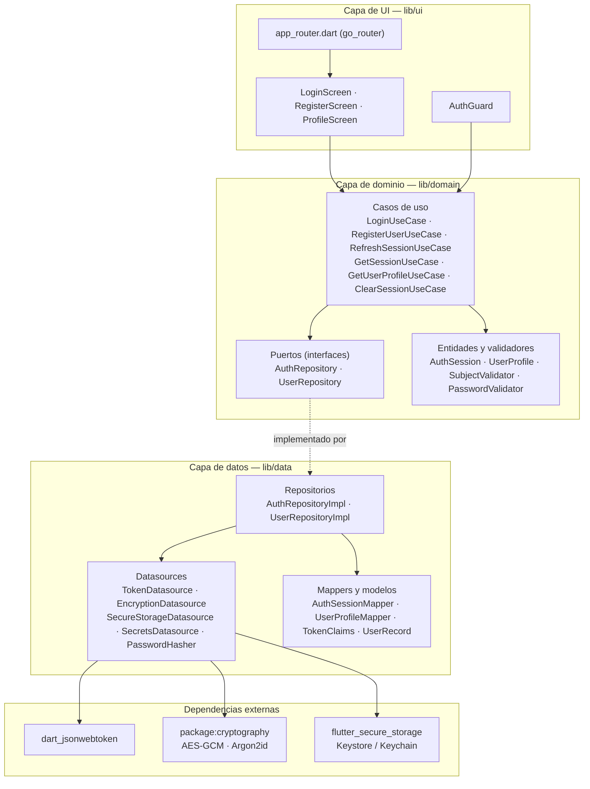
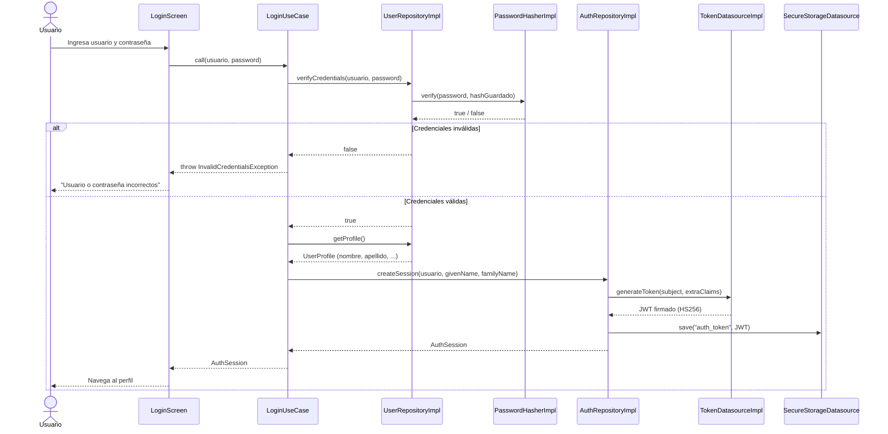
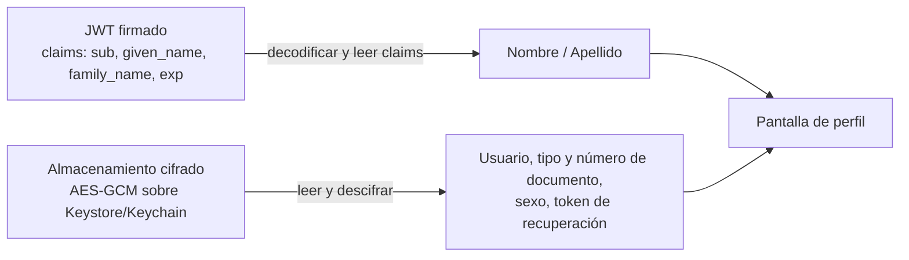
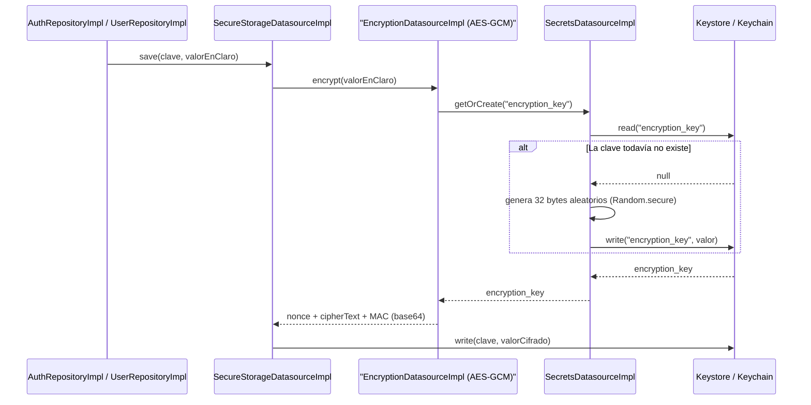
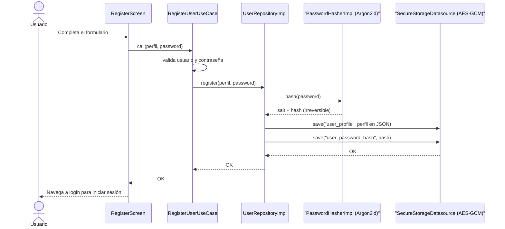
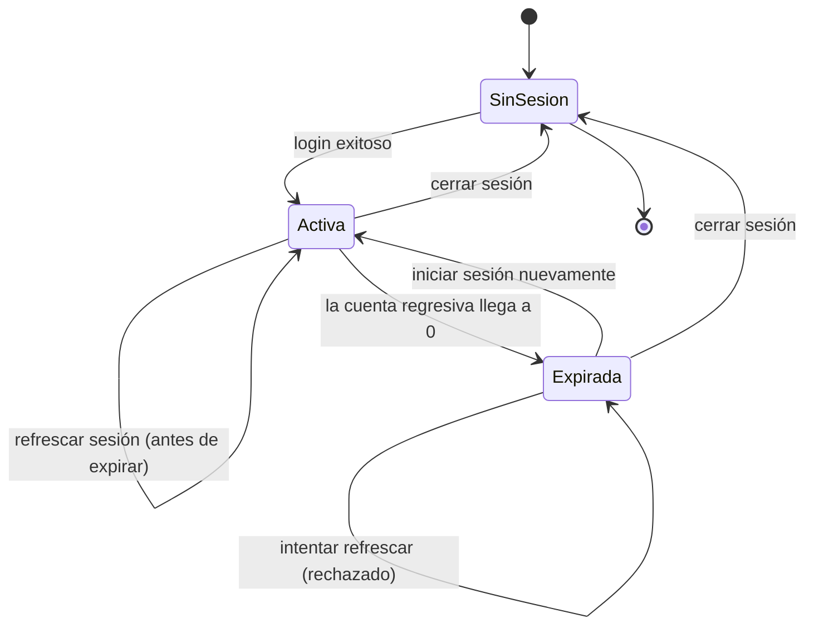

# Arquitectura y seguridad de la aplicación

Este documento explica qué problema resuelve la aplicación, cómo está organizado el código, qué algoritmos de seguridad se usan y por qué, y cómo fluye la información en cada operación principal (registro, inicio de sesión, visualización del perfil, refresco y cierre de sesión).

Para el modelo de amenazas, los gaps aceptados y las recomendaciones de build para producción, ver [`SECURITY.md`](../../SECURITY.md) en la raíz del proyecto.

## Contenido

- [Qué resuelve la aplicación](#qué-resuelve-la-aplicación)
- [Arquitectura del proyecto](#arquitectura-del-proyecto)
- [Estructura de carpetas](#estructura-de-carpetas)
- [Manejo de tokens de autenticación (JWT)](#manejo-de-tokens-de-autenticación-jwt)
- [Cifrado de datos sensibles](#cifrado-de-datos-sensibles)
- [Almacenamiento seguro en el dispositivo](#almacenamiento-seguro-en-el-dispositivo)
- [Registro e inicio de sesión de usuarios](#registro-e-inicio-de-sesión-de-usuarios)
- [Sesión: cuenta regresiva, refresco y expiración](#sesión-cuenta-regresiva-refresco-y-expiración)
- [Gestión de secretos y hardening adicional](#gestión-de-secretos-y-hardening-adicional)
- [Algoritmos utilizados (resumen)](#algoritmos-utilizados-resumen)

## Qué resuelve la aplicación

La app necesita manejar información de usuarios (credenciales, documento de identidad, token de recuperación) de forma segura en un dispositivo móvil, sin backend. Para eso resuelve, de punta a punta:

1. **Autenticación con tokens**: generación, almacenamiento, validación y expiración de tokens de sesión (JWT), con un flujo completo de registro → login → perfil → logout.
2. **Cifrado de datos sensibles**: qué algoritmo se usa, por qué, y cómo se cifra/descifra de forma transparente todo lo que la app persiste localmente.
3. **Almacenamiento seguro**: los datos sensibles nunca tocan el disco en texto plano; se apoyan en el almacenamiento protegido por el sistema operativo (Keystore en Android, Keychain en iOS).
4. **Revisión y mejora continua de la seguridad**: los secretos de la propia app (clave de firma de tokens, clave de cifrado) se generan en el dispositivo y nunca viven en el código fuente ni en el binario; hay validación de entradas, bloqueo de capturas de pantalla, y control explícito del ciclo de vida de la sesión (cuenta regresiva, refresco, rechazo de refrescos sobre sesiones ya vencidas).

Las tres técnicas de protección de datos se muestran, una junto a otra, en la misma pantalla de perfil:

| Técnica | Es reversible | Dónde se usa |
|---|---|---|
| Hash (Argon2id) | No — solo se puede verificar, nunca recuperar | Contraseña del usuario |
| Cifrado simétrico (AES-GCM) | Sí — se descifra con la clave correcta | Token de sesión, perfil del usuario (documento, sexo, token de recuperación, usuario) |
| Claims de un JWT firmado | No aplica (no es secreto, es verificable) | Nombre y apellido, embebidos en el token en el momento del login |

## Arquitectura del proyecto

El proyecto sigue **Clean Architecture** con tres capas y una regla de dependencia estricta: la UI depende del dominio, el dominio no depende de nada externo, y la capa de datos implementa los puertos que el dominio define.



Puntos clave del diseño:

- **Puertos e interfaces**: el dominio nunca conoce una implementación concreta. `AuthRepository` y `UserRepository` son interfaces (`abstract interface class`); `AuthRepositoryImpl` y `UserRepositoryImpl` viven en la capa de datos y son las únicas que conocen `dart_jsonwebtoken`, `package:cryptography` o `flutter_secure_storage`.
- **Casos de uso como única puerta de entrada**: la UI nunca llama a un repositorio directamente, siempre pasa por un caso de uso (`LoginUseCase`, `RegisterUserUseCase`, etc.), que es donde vive la validación y la orquestación de reglas de negocio.
- **Mappers**: la forma en que un dato se representa en la capa de datos (por ejemplo, `TokenClaims` con el payload crudo de un JWT, o `UserRecord` como JSON) no necesariamente coincide con la entidad de dominio (`AuthSession`, `UserProfile`). Los mappers (`AuthSessionMapper`, `UserProfileMapper`) hacen esa traducción explícita.
- **Inyección de dependencias**: `lib/injection_container.dart` es el único lugar donde se construyen las implementaciones concretas y se registran en un contenedor (`get_it`). Ningún archivo de UI o dominio instancia una clase de datos directamente.

## Estructura de carpetas

```text
lib/
├── data/
│   ├── config/          # Configuración no sensible (p. ej. duración del token)
│   ├── datasources/      # Wrappers sobre librerías/APIs externas (puerto + implementación)
│   ├── mappers/          # Traducción entre modelos de datos y entidades de dominio
│   ├── models/            # Formas de datos propias de la capa de datos (JSON, claims)
│   └── repositories/      # Implementación concreta de los puertos del dominio
├── domain/
│   ├── entities/          # Objetos de negocio puros (AuthSession, UserProfile, enums)
│   ├── exceptions/        # Errores de negocio tipados
│   ├── repositories/      # Puertos (interfaces) que la capa de datos debe cumplir
│   ├── usecases/          # Orquestación de reglas de negocio, punto de entrada desde la UI
│   └── validators/        # Reglas de validación reutilizables
├── ui/
│   ├── router/            # Configuración de rutas (go_router)
│   ├── screens/           # Pantallas (Login, Register, Profile)
│   └── widgets/           # Widgets compartidos (AuthGuard)
└── injection_container.dart  # Composition root: registra todas las dependencias (get_it)
```

## Manejo de tokens de autenticación (JWT)

La sesión del usuario se representa como un **JSON Web Token firmado con HS256** (`dart_jsonwebtoken`), generado y validado por `TokenDatasourceImpl`.

- **Generación** (`TokenDatasourceImpl.generateToken`): firma un payload con el `subject` (nombre de usuario) y claims adicionales opcionales (`given_name`, `family_name`), con una expiración configurable (`SecurityConfig.tokenLifetime`).
- **Validación** (`TokenDatasourceImpl.validateToken`): verifica la firma y la expiración; si el token fue manipulado o ya venció, retorna `null` en lugar de lanzar una excepción genérica, para que la capa superior decida qué hacer (por ejemplo, `AuthGuard` muestra "Acceso no autorizado").
- **Persistencia**: el token firmado se guarda cifrado (ver [Almacenamiento seguro](#almacenamiento-seguro-en-el-dispositivo)) bajo la clave `auth_token`, y se borra explícitamente al cerrar sesión (`ClearSessionUseCase`).
- **Claims personalizados como fuente de datos**: además de autenticar, el token transporta el nombre y apellido del usuario. La pantalla de perfil los lee decodificando el token (`AuthSession.givenName` / `familyName`), sin necesidad de otra consulta al almacenamiento — a propósito, para mostrar esta forma alternativa de "recuperar datos" frente a leer y descifrar el perfil guardado.



La pantalla de perfil combina, a propósito, las dos fuentes de datos posibles:



## Cifrado de datos sensibles

Todo lo que la app persiste a través de `SecureStorageDatasource` se cifra de forma transparente con **AES-GCM de 256 bits** (`package:cryptography`, `AesGcm.with256bits()`) antes de escribirse en disco.

¿Por qué AES-GCM? Es un cifrado **autenticado**: en una sola operación protege confidencialidad (nadie puede leer el dato sin la clave) e integridad (cualquier manipulación del texto cifrado hace fallar el descifrado), a diferencia de modos como AES-CBC que necesitan un MAC aparte para detectar manipulación.

- **Nonce aleatorio por operación**: cada llamada a `encrypt` genera un nonce distinto, así que cifrar el mismo texto dos veces produce salidas distintas (protege contra análisis de patrones).
- **Formato de salida**: `nonce + cipherText + MAC`, concatenados y codificados en base64 en un único string, listo para guardar con cualquier datasource de texto.
- **Clave de cifrado**: nunca está hardcodeada; se genera y se guarda en el Keystore/Keychain (ver [Gestión de secretos](#gestión-de-secretos-y-hardening-adicional)).



## Almacenamiento seguro en el dispositivo

`SecureStorageDatasourceImpl` persiste usando `flutter_secure_storage`, que a su vez se apoya en el **Keystore de Android** y el **Keychain de iOS/macOS** — almacenamiento respaldado por hardware en la mayoría de los dispositivos modernos, distinto de `SharedPreferences`/`UserDefaults` (que guardan en texto plano).

Endurecimientos aplicados sobre la configuración por defecto del paquete:

- **iOS/macOS**: `KeychainAccessibility.unlocked_this_device` en vez del valor por defecto (`unlocked`). El dato solo es legible mientras el dispositivo está desbloqueado, y **nunca se restaura en otro dispositivo** vía backup/iCloud — no tiene sentido que el token de sesión o el perfil de este dispositivo migren a otro.
- **Android**: la versión del paquete usada ya cifra con AES-GCM y envuelve la clave con RSA-OAEP por defecto (API 23+), sin necesidad de configuración adicional.

Todo lo que se guarda así queda cifrado antes de tocar el disco (ver sección anterior), y se borra explícitamente cuando corresponde: `ClearSessionUseCase` elimina el token al cerrar sesión.

## Registro e inicio de sesión de usuarios

El registro captura todos los datos requeridos del usuario (nombre, apellido, tipo y número de documento, usuario, contraseña, sexo, token de recuperación de 4 dígitos) y aplica una técnica de protección distinta según qué tan sensible es cada dato y si necesita poder recuperarse:



Reglas de validación (defensa en profundidad: se aplican tanto en el formulario como en el caso de uso, para que nadie pueda saltárselas llamando al caso de uso directamente):

| Campo | Regla |
|---|---|
| Usuario | 3 a 32 caracteres; solo letras, números, `-` y `_` |
| Contraseña | 8 a 64 caracteres, sin restricción de símbolos (limitar el charset reduce la entropía) |
| Token de recuperación | Exactamente 4 dígitos |
| Resto de campos | Obligatorios (no vacíos) |

El inicio de sesión (ver diagrama en la sección anterior) verifica las credenciales contra lo guardado en el registro — nunca compara contraseñas en texto plano, siempre recalcula el hash del valor ingresado y lo compara contra el guardado.

## Sesión: cuenta regresiva, refresco y expiración

La sesión no queda indefinidamente activa: `AuthSession.expiresAt` define cuándo vence, y la pantalla de perfil muestra una cuenta regresiva en tiempo real y permite refrescarla antes de que expire.



- **Refrescar sesión** (`RefreshSessionUseCase`): emite un nuevo token para el mismo usuario, con las mismas claims (nombre/apellido), y lo persiste en lugar del anterior. Antes de hacerlo, valida `currentSession.isValid`; si la sesión ya expiró, lanza `ExpiredSessionException` sin llegar a generar ningún token, y la UI muestra el mensaje correspondiente en vez de refrescarla silenciosamente.
- **Token de recuperación oculto por defecto**: en la pantalla de perfil se muestra enmascarado (como una contraseña), con un ícono para revelarlo. Ese ícono se deshabilita automáticamente y el valor se vuelve a ocultar en cuanto la sesión expira.

## Gestión de secretos y hardening adicional

Dos valores deben permanecer secretos para que el resto del sistema funcione: la clave de firma de los tokens y la clave de cifrado AES. Ninguno de los dos vive en el código fuente ni en un archivo empaquetado con la app: `SecretsDatasourceImpl` los genera aleatoriamente (`Random.secure()`, 32 bytes) la primera vez que se necesitan y los guarda directamente en el Keystore/Keychain del dispositivo — sin pasar por la propia capa de cifrado de la app, para evitar la dependencia circular de que la clave de cifrado dependa de sí misma para protegerse.

Otras medidas adicionales:

- **Validación de entradas** en usuario, contraseña y token de recuperación (ver tabla en la sección de registro), tanto en la UI como en el dominio.
- **Bloqueo de capturas de pantalla y grabación de pantalla en Android** (`FLAG_SECURE` en `MainActivity`), y ocultamiento del contenido en la miniatura del selector de apps recientes, mientras la app maneja el token de sesión.
- **Expiración y refresco explícito de la sesión** (ver sección anterior), en vez de dejar un token válido indefinidamente.

El detalle de qué queda fuera de alcance (por ejemplo, que iOS no tiene un equivalente directo a `FLAG_SECURE`) y las recomendaciones para producción están en [`SECURITY.md`](../../SECURITY.md).

## Algoritmos utilizados (resumen)

| Propósito | Algoritmo | Paquete |
|---|---|---|
| Firma y verificación de tokens de sesión | JWT con HMAC-SHA256 (HS256) | `dart_jsonwebtoken` |
| Cifrado de datos en reposo | AES-GCM 256 bits (cifrado autenticado) | `package:cryptography` |
| Hash de contraseñas | Argon2id (memoria 19 MB, 2 iteraciones, salt aleatorio de 16 bytes) | `package:cryptography` |
| Generación de secretos y sales | Generador aleatorio criptográficamente seguro (`Random.secure()`) | `dart:math` |
| Almacenamiento en reposo | Keystore (Android) / Keychain (iOS-macOS) | `flutter_secure_storage` |
